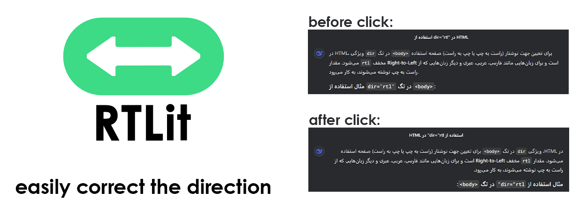

# RTLit - Chrome Extension


**RTLit** is a practical Chrome extension that instantly toggles webpage text direction between Left-To-Right (LTR) and Right-To-Left (RTL) with a single click. Designed specifically for ***Persian/Farsi*** speakers and RTL language users who struggle with mixed-direction content.

<br>

## Key Features
- One-click text direction toggle
- Lightweight with no browser performance impact
- Works on all webpages

<br>

## Installation

1. Download the repository or clone with git:
   ```bash
   git clone https://github.com/Abssdghi/RTLit.git
   ```
2. Open Chrome and navigate to:
     ```bash
   chrome://extensions/
     ```
4. Enable "Developer mode" (top-right toggle)
5. Click "Load unpacked" and select the project folder

<br>

## Usage
After installation:

1. Locate the RTLit icon in Chrome's toolbar
2. Click to toggle text direction between RTL/LTR
3. Enjoy more comfortable reading!

<br>

## Use Cases
- Reading Persian/Arabic articles containing English words
- Better browsing experience on multilingual sites
- Direction testing for web developers

<br>

## License

Released under [MIT License](LICENSE).

<br>

## Support

If you find this useful, please ⭐ the repository!

<br>

Made with ❤ by [Abbas Sadeghi](https://github.com/abssdghi)
